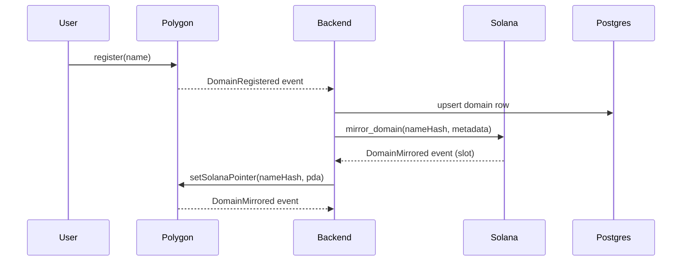
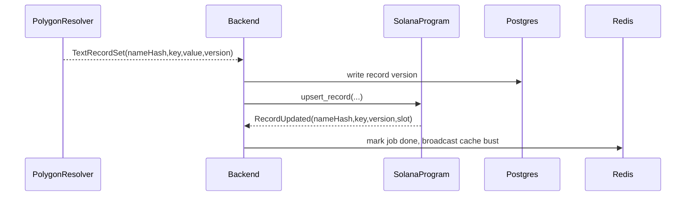

## Cross-Chain Name Service Implementation Plan

### 1. Step-by-Step Plan
1. **Foundation (Week 1)**
   - Lock conflict-resolution policy (`PolygonPriority`).
   - Update `PNSRegistry`, `PNSResolver`, and `PNSDomainNFT` to emit sync-friendly events and track Solana pointers/NFT wrapping state.
   - Add Anchor program scaffolding for mirrored domains, records, and NFT state.
   - Introduce backend persistence layer (Postgres + Redis) with mapping + record tables.
2. **Sync Engine (Week 2)**
   - Ship Polygon event indexer (registrations, resolver updates, NFT wraps).
   - Ship Solana log subscriber for `RecordUpdated` and `DomainMirrored`.
   - Implement bidirectional workers with retry, dedupe, and idempotent checkpoints.
3. **API + NFT (Week 3)**
   - Expose record CRUD + NFT wrap/unlock REST endpoints.
   - Wire metadata server + dynamic JSON for both chains.
   - Finalize Metaplex instruction helpers and ERC721 hooks.
4. **Hardening (Week 4)**
   - End-to-end tests on Anvil + local validator.
   - Backfill historical domains via migration jobs.
   - Load testing, monitoring hooks, and documentation polish.

### 2. Polygon Contract Changes
| Contract | Key Updates |
| --- | --- |
| `PNSRegistry` | - Add `struct MirrorInfo { bytes32 solanaPda; uint64 syncedSlot; uint8 nftState; }`<br>- Map `nameHash -> MirrorInfo` and expose `setSolanaPointer`, `setNFTState` (only controller).<br>- Emit `DomainMirrored`, `RecordSyncRequested`, `NFTWrapped` events.<br>- Store per-record `uint64 version` + `uint64 lastUpdated` for conflict resolution.<br>- Freeze flag on records when Solana overwrites. |
| `PNSResolver` | - Unified `RecordValue` using `bytes` to support address/text/content/custom types.<br>- Add `setRecord(bytes32 nameHash, bytes32 keyHash, uint8 recordType, bytes data)` and `clearRecord`.<br>- Emit deterministic events consumed by backend indexer (includes version + source chain). |
| `PNSDomainNFT` | - Track mint location via `enum MintChain { None, Polygon, Solana }` stored in `mapping(bytes32 => MintChain)`.<br>- Implement `freeze`/`unfreeze` (controller-only) + metadata hook that reads backend API.<br>- Emit `DomainWrapped`/`DomainUnwrapped` with `chainId` to coordinate cross-chain exclusivity.<br>- Add transfer hook that notifies registry (via event) so backend can mirror ownership. |

### 3. Solana Program Updates (`pns_anchor`)
- Registry now stores:
  - `authority` (backend signer), `polygon_registry` (20 bytes), `conflict_policy`, `domain_count`, `bump`.
- `DomainAccount` now includes:
  - `name_hash`, `polygon_owner` (20 bytes), `solana_delegate`, `resolver`, `expiration`, `nft_mint`, `wrap_state`, `record_count`, `last_polygon_tx`, `bump`.
- New PDA: `RecordAccount` (`seeds = ["record", domain, key_hash]`) storing `record_type`, `key_hash`, `data`, `version`, `last_source_chain`, `last_updated_slot`, `bump`.
- Instructions:
  1. `initialize(authority, polygon_registry, conflict_policy)`
  2. `mirror_domain(name_hash, polygon_owner, delegate, expiration, resolver, polygon_tx)`
  3. `update_delegate(name_hash, new_delegate)`
  4. `upsert_record(name_hash, key_hash, record_type, data, source_chain, version)`
  5. `delete_record(...)`
  6. `mark_polygon_checkpoint(name_hash, polygon_tx, expiration)`
  7. `set_wrap_state(name_hash, nft_mint, wrap_state)`
- Access control: only `registry.authority` or `domain.solana_delegate` (when `allow_delegate_mutations` flag set) may mutate.
- Events (`#[event]`):
  - `DomainMirrored`, `RecordUpdated`, `RecordDeleted`, `WrapStateChanged`.

### 4. Backend Architecture
- **Services**
  - `PolygonService`: extended ABI for registry/resolver/NFT; fetch events via `ethers.WebSocketProvider`.
  - `SolanaService`: Anchor client helpers for new instructions + Metaplex NFT wrappers.
  - `MappingService`: Postgres-backed store for `domains`, `records`, `sync_jobs`, `nft_metadata`.
  - `RecordService`: orchestrates writes → Polygon+Solana using conflict rules.
  - `NFTService`: ensures single active NFT, proxies metadata GET `/metadata/:chain/:tokenId`.
  - `SyncService`: background workers + cron monitors, uses Redis for dedupe and rate limiting.
- **APIs**
  - `POST /api/records` `PUT /api/records/:id` `DELETE /api/records/:id`
  - `GET /api/records/:domain` (merged view)
  - `POST /api/nft/wrap` / `POST /api/nft/unwrap`
  - `POST /api/sync/reconcile` (admin-only)
  - Existing `/register`, `/renew`, `/domain`, etc. now call `CrossChainService`.
- **Workers**
  - `PolygonIndexerWorker` (polls events → Postgres).
  - `SolanaLogWorker` (websocket subscription).
  - `ReconciliationWorker` (diff Postgres vs on-chain hourly).

### 5. Data Models & Storage Layout
**Postgres**
```sql
domains(name_hash PK, label text, owner_polygon bytea, owner_solana text, 
        polygon_token_id numeric, solana_pda bytea, expiration timestamptz,
        wrap_state smallint, last_polygon_tx bytea, last_solana_slot bigint,
        last_synced timestamptz);

records(id uuid PK, name_hash FK, key_hash bytea, key text, record_type smallint,
        value jsonb, source_chain text, version bigint, updated_at timestamptz,
        UNIQUE(name_hash, key_hash));

sync_jobs(id uuid PK, job_type text, payload jsonb, status text, 
          retry_count int, last_error text, created_at timestamptz, updated_at timestamptz);

nft_metadata(token_id text PK, chain text, name_hash bytea, uri text,
             last_generated timestamptz, frozen boolean);
```

**Solana Accounts**
- `Registry`: 8 (discriminator) + 32 (authority) + 20 (polygon_registry) + 1 (conflict_policy) + 8 (domain_count) + 1 (bump) = 70 bytes.
- `DomainAccount`: 8 + 32 + 20 + 32 + 33 + 8 + 33 + 1 + 2 + 32 + 1 ≈ 170 bytes (rounded to 192 incl. padding).
- `RecordAccount`: 8 + 32 (domain) + 32 (key_hash) + 1 (record_type) + 1 (source_chain) + 8 (version) + 8 (slot) + 4 (len) + N (data) + 1 (bump).

**Polygon Storage**
- `records[nameHash] => NameRecord { owner, resolver, expiration, version }`
- `recordVersions[nameHash][keyHash] => uint64`
- `mirrors[nameHash] => MirrorInfo`
- `wrapState[nameHash] => uint8`

### 6. Sync Flow Diagrams
**Domain Registration + Mirror**


**Record Update (Polygon -> Solana)**


### 7. Testing Plan
- **Unit**
  - Solidity: cover new registry/resolver/NFT logic (wrapping guards, pointer updates, version increments).
  - Rust: Anchor tests for mirror/record/wrap instructions, conflict policy enforcement.
  - Backend: Jest tests for RecordService conflict resolution, MappingService migrations.
- **Integration**
  - Spin up Anvil + solana-test-validator via `start-local-all.sh`.
  - Run `backend/tests/crosschain.spec.ts` to register domain on Polygon, wait for backend to mirror to Solana, set record, assert both chains updated.
  - NFT wrap tests verifying mutual exclusivity (mint on Solana fails if Polygon minted).
- **Cross-Chain Testnet**
  - Mumbai + Devnet pipelines.
  - Use feature flags to throttle writes (Polygon authoritative).
  - Observability: Cron job verifying Postgres vs on-chain daily.

### 8. Migration Steps
1. Snapshot all Polygon domains via script (already in Foundry).
2. Backfill Postgres `domains`/`records` tables.
3. For each domain: compute Solana PDA `["domain", nameHash]`.
4. Backend issues `mirror_domain` instructions in batches (500/domain), rate-limited.
5. Once mirrored, call `setSolanaPointer` on Polygon to freeze old state.
6. For existing NFTs minted on Polygon, mark `wrap_state = Polygon` and block Solana wrapping until user unwraps.
7. Rebuild caches, enable workers, monitor.

### 9. Key Decisions
- **Source of Truth**: Polygon is authoritative for ownership + record versions (`PolygonPriority`). Solana writes must include last Polygon version; backend rejects if stale.
- **PDA Layout**: Domain PDAs derived from `["domain", name_hash]` so backend can deterministically compute from Polygon events.
- **NFT Policy**: NFTs are wrappers (not bridging). Only one chain may have an active wrapper; bridging is an unwrap+wrap flow orchestrated by backend.
- **Events Needed**
  - Polygon: `DomainRegistered`, `DomainMirrored`, `RecordSyncRequested`, `RecordUpdated`, `NFTWrapped`, `NFTUnwrapped`.
  - Solana: `DomainMirrored`, `RecordUpdated`, `WrapStateChanged`.
- **Solana → Polygon Updates**: Allowed only when backend marks request as `solana_override`. Backend writes to Polygon resolver and logs `source_chain = solana`; Polygon event then re-syncs to confirm.

---

This plan aligns all three layers (Polygon, Solana, backend) around deterministic PDAs, explicit conflict policy, and observable sync jobs.

